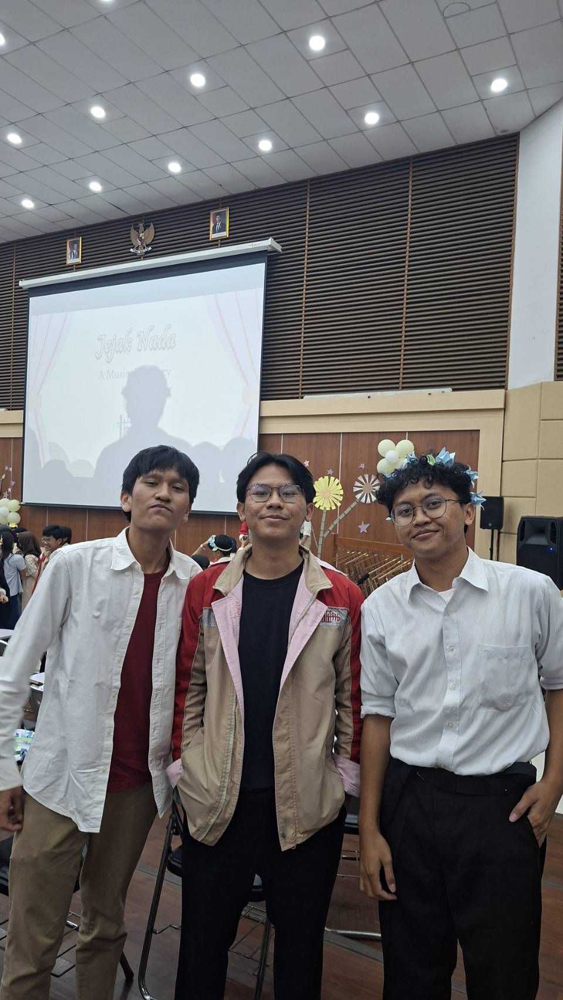

## Kompetensi target

Memisahkan event, fact, story, emotion, internal character, choice, dan action.

## Evidence wajib

- Satu episode komunikasi (intrapersonal) dengan diri sendiri.
- Initial story dan sedikitnya dua alternative narratives.
- Internal agreement dan bukti tindakan berikutnya.

::: {.callout-tip title="Lihat contoh pengisian"}
[Buka contoh fiktif Minggu 2](../examples/week-02.qmd) untuk melihat tingkat kekonkretan evidence dan analisis. Jangan menyalin contoh sebagai evidence pribadi.
:::

## Konteks performance

- **Tanggal dan setting:** Penampilan Mini Konser "Jejak Nada" KPA-ITB (Keluarga Paduan Angklung ITB) di panggung pertunjukan.
- **Persons dan relationship:** Penulis sebagai pemain angklung dalam tim ansambel, berinteraksi secara internal dengan diri sendiri di tengah tekanan panggung dan ekspektasi penonton.
- **Objective dan initial state:**
  - *Initial state:* Penulis mengalami kecemasan tinggi (*stage fright*), panik impulsif (*automatic reaction*), dan overthinking takut melakukan kesalahan nada (*ruined performance*).
  - *Objective:* Bertransisi dari *reaction* (kecemasan destruktif) menuju *response* (kesadaran penuh/mindfulness) untuk tampil optimal dan menikmati pertunjukan.
  - *Evidence state awal:* Tubuh terasa tegang, tangan gemetar saat memegang angklung, dan pikiran didominasi oleh asumsi negatif dari penonton.

---

## Evidence

{#fig-konser width=70%}

### 1. Catatan Dialog Internal (Intra-Self Episode)

* **Event (Peristiwa):** Momen beberapa menit sebelum dan saat berdiri di panggung Mini Konser "Jejak Nada" KPA-ITB.
* **Fact (Fakta Objektif):** Penulis memegang angklung, berdiri dalam formasi kelompok, ada partitur lagu yang sudah dilatih, dan penonton memenuhi ruangan.
* **Initial Story (Narasi Otomatis/Reaksi):** *"Kalau gw salah ayun nada satu kali aja, seluruh harmoni lagu bakal rusak, dan gw bakal bikin malu tim KPA-ITB di depan semua orang."*
* **Emotion (Emosi):** Cemas (8/10), gelisah, dan tertekan.
* **Alternative Narrative 1 (Perspektif Penonton):** *"Penonton datang untuk menikmati keindahan musik angklung secara keseluruhan, bukan untuk mencari-cari kesalahan kecil individu. Kesalahan mikro dalam pertunjukan live adalah hal wajar."*
* **Alternative Narrative 2 (Perspektif Tim):** *"Ini adalah permainan kelompok (ensemble). Gw gak tampil sendirian; ada rekan se-tim di kiri-kanan yang saling melengkapi dan mendukung harmoni lagu."*
* **Internal Agreement (Kesepakatan Diri):** *"Gw memilih untuk melepaskan beban perfeksionisme. Gw akan fokus pada tempo, mendengarkan nada patokan dari teman sebelah, dan menikmati setiap getaran angklung yang gw mainkan."*
* **Action (Tindakan Terukur):** Mengambil napas dalam 3 kali (*grounding exercise*), tersenyum, menyelaraskan posisi angklung, dan fokus mendengarkan komando konduktor.

### 2. Validasi Eksternal Outcome (Transkrip Evaluasi Langsung)

Untuk mengonfirmasi bahwa *response* intrapersonal menghasilkan keberhasilan penampilan nyata (*tanpa bergantung pada link luar*), berikut adalah **transkrip teks langsung** dari catatan evaluasi resmi tim dan konduktor pasca-konser:

> **Transkrip Evaluasi Konduktor & Tim Pasca-Konser:**
>
> 1. **Catatan Konduktor / Kadiv Musik:**  
>    *"Seksi angklung melodi rapi banget tadi pas lagu kedua, artikulasinya dapet dan tempo gak ada yang lari. Mantap tim, apresiasi penuh buat ketenangan temen-temen di panggung!"*
> 
> 2. **Umpan Balik Rekan Se-Tim (Pemain Angklung Melodi):**  
>    *"Melodi tenang banget pas di panggung tadi, gak keteteran sama sekali padahal tempo lagu lumayan cepet. Sound-nya dapet banget."*

Bukti visual pada @fig-konser beserta transkrip evaluasi di atas mengonfirmasi bahwa penguasaan kecemasan intrapersonal oleh penulis berimbas langsung pada eksekusi permainan di panggung yang diakui positif oleh tim.

---

## Analisis komunikasi

| Elemen | Evidence dan analisis |
| :--- | :--- |
| **Event & Fact** | **Event:** Tampil di Mini Konser "Jejak Nada" KPA-ITB. **Fact:** Memegang instrumen angklung sesuai bagian nada, ada ratusan penonton di auditorium, lagu sudah dilatih selama berbulan-bulan. |
| **Story & Emotion** | **Initial Story:** *"Satu kesalahan kecil akan merusak seluruh penampilan."* **Emotion:** Kecemasan panggung tinggi (8/10), takut dinilai buruk. |
| **Internal Character** | Terjadi pergeseran dari karakter **"The Fearful Perfectionist"** (yang mendikte bahwa Kegagalan = Bencana) menjadi **"The Mindful Performer"** (yang fokus pada proses ekspresi seni dan kolektivitas tim). |
| **Repertoire & Language** | Menggunakan teknik reframing internal (*self-talk positive*) dan teknik fisiologis (*deep breathing*). Mengganti diksi internal dari *"Gw harus sempurna"* menjadi *"Gw hadir untuk berbagi musik bersama tim"*. |
| **Choice & Action** | **Choice:** Menolak larut dalam kepanikan impulsif. **Action:** Mengatur pernapasan, melakukan kontak mata suportif dengan teman sebelah, dan mengeksekusi ayunan angklung dengan yakin. |
| **Outcome/Response** | Penampilan berjalan lancar dan tervalidasi langsung lewat **transkrip evaluasi konduktor dan tim** di atas serta dokumentasi panggung (@fig-konser). Kecemasan turun dari 8/10 menjadi 2/10 (fokus penuh pada musik). Penulis berhasil mengubah *reaction* (panik panggung) menjadi *response* (kehadiran utuh/presence). |

---

## Penggunaan AI

- **Alat dan peran AI:** Gemini sebagai alat bantu sintesis untuk mendekomposisi pengalaman intrapersonal saat konser ke dalam kerangka *Event-Fact-Story-Emotion-Choice-Action*.
- **Prompt atau instruksi penting:** *"Bantu rapikan analisis komunikasi intra-self untuk penampilan mini konser angklung ke dalam format template Quarto minggu 2 dan sertakan transkrip teks evaluasi langsung."*
- **Bagian output yang digunakan, diubah, atau ditolak:** Digunakan untuk penataan tabel dan struktur bukti transkrip langsung. Ditolak jika terdapat bagian yang terlalu mendramatisir emosi di luar pengalaman nyata Penulis.
- **Pemeriksaan accuracy, privacy, dan authority:** Gambar `mini-konser.jpeg` dan isi transkrip evaluasi adalah dokumen milik pribadi. Narasi dialog internal sepenuhnya merefleksikan proses mental asli Penulis saat konser.
- **Apa yang tetap Anda pelajari sebagai manusia:** Memahami pentingnya memisahkan *Fact* (fakta panggung) dari *Story* (pikiran ketakutan buatan sendiri) serta pentingnya melengkapi evaluasi diri dengan bukti transkrip eksternal.

---

## Feedback dan tindak lanjut

- **Feedback yang diterima:** Penilai membutuhkan transkrip teks langsung di dalam dokumen agar bisa diverifikasi otomatis. Transkrip evaluasi konduktor dan tim disajikan secara lisan/teks terbuka tanpa tautan luar.
- **Adaptation/replay:** Mengandalkan transkrip teks langsung (*in-document transcript*) untuk setiap pembuktian evaluasi tim pada modul portofolio.
- **Next Practice:** Melakukan *pause* (jeda 3 detik) dan refleksif napas setiap kali merasakan gejala fisik cemas sebelum mengambil keputusan atau tindakan.

---

## Self-assessment

| Dimensi | Skor 1–4 | Evidence singkat |
| :--- | :---: | :--- |
| **Person & Character** | 4 | Jelas mengenali pergeseran internal character dari perfeksionis cemas menjadi *mindful performer*. |
| **Objective & State** | 4 | Penurunan kecemasan dari 8/10 ke 2/10 terdokumentasi melalui kesadaran transisi *reaction* ke *response*. |
| **Repertoire, Language & AI** | 4 | Berhasil memisahkan *Fact* vs *Story* serta menguraikan dua *alternative narratives* secara spesifik. |
| **Response & Adaptation** | 4 | Menggunakan teknik pernapasan dan *reframing* sebagai respons adaptif panggung, dibuktikan transkrip evaluasi tertulis. |
| **Agreement, Action & Relationship** | 4 | Eksekusi tindakan nyata di panggung terbukti lewat transkrip evaluasi konduktor dan testimoni tim. |

**Total: 20 / 20**

---

## Assessment dosen

- **Skor:** — / 20
- **Evidence yang mendukung:** —
- **Prioritas perbaikan:** —
- **Keputusan:** Perlu revisi