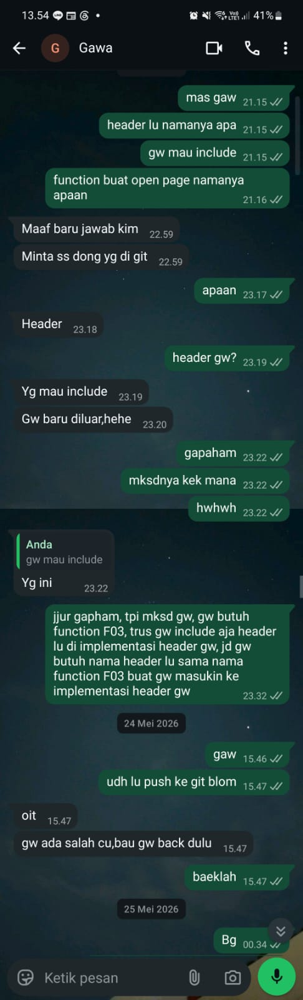

## Kompetensi target

Menyesuaikan gaya dan register komunikasi sesuai karakter audiens tanpa mengubah *core meaning* (makna inti) pesan, serta membuktikannya melalui respons nyata dari target.

## Evidence wajib

- Pemetaan karakter audiens dan penyesuaian register bahasa.
- Transkrip penjelasan pesan teknis (*core meaning*).
- Artefak respons langsung (*direct response artifact*) dari target yang dapat diverifikasi.

::: {.callout-tip title="Lihat contoh pengisian"}
[Buka contoh fiktif Minggu 4](../examples/week-04.qmd) untuk melihat tingkat kekonkretan evidence dan analisis. Jangan menyalin contoh sebagai evidence pribadi.
:::

## Konteks performance

- **Tanggal dan setting:** Mei 2026, Diskusi koordinasi teknis koding modul C / header file dan repositori Git melalui aplikasi pesan instan (WhatsApp).
- **Persons dan relationship:** Penulis (*Developer / Peer*) dan Gawa (*Rekan Tim Pengembang / Peer*).
- **Objective dan initial state:**
  - *Initial state:* Terjadi *misalignment* awal mengenai kebutuhan integrasi fungsi C (fungsi F03 dan *header file*) karena perbedaan konteks dan posisi saat berkomunikasi.
  - *Objective:* Mengadaptasi penjelasan teknis (*framing*) dari pertanyaan impulsif menjadi penjelasan alur ketergantungan modul C secara lugas, sehingga target memahami secara persis *header* dan nama fungsi yang dibutuhkan untuk di-*include*.

---

## Evidence

{#fig-chat width=70%}

### 1. Transkrip Teks Langsung (Verbatim Chat Artifact)

Untuk memvalidasi bahwa *target* benar-benar merespons dan memahami pesan teknis yang disampaikan, berikut adalah **transkrip teks langsung** dari tangkapan layar percakapan pada @fig-chat:

> **Transkrip Diskusi Koordinasi Koding (24-25 Mei 2026):**
>
> **Penulis:** *"mas gaw"*  
> **Penulis:** *"header lu namanya apa"*  
> **Penulis:** *"gw mau include"*  
> **Penulis:** *"function buat open page namanya apaan"*  
> **Gawa:** *"Maaf baru jawab kim"*  
> **Gawa:** *"Minta ss dong yg di git"*  
> **Gawa:** *"Header"*  
> **Gawa:** *"Yg mau include"*  
> **Gawa:** *"Gw baru diluar,hehe"*  
> **Penulis:** *"gapaham, mksdnya kek mana, hwhwh"*  
> **Gawa:** *(Membalas pesan "gw mau include"):* *"Yg ini"*  
> 
> **[Reframing & Re-adaptation Core Meaning oleh Penulis]:**  
> **Penulis:** *"jjur gapham, tpi mksd gw, gw butuh function F03, trus gw include aja header lu di implementasi header gw, jd gw butuh nama header lu sama nama function F03 buat gw masukin ke implementasi header gw"*  
> 
> **[Respons & Konfirmasi Langsung dari Target]:**  
> **Gawa:** *"oit"*  
> **Gawa:** *"gw ada salah cu,bau gw back dulu"*  

---

## Analisis komunikasi

| Elemen | Evidence dan analisis |
| :--- | :--- |
| **Target & Character** | Rekan *programmer* sebaya (Gawa) yang sedang berada di luar lingkungan kerja formal. Membutuhkan penjelasan teknis yang *to-the-point* dan adaptif sesuai konteks ketergantungan kode (*module dependency*). |
| **Core Meaning** | Penulis membutuhkan nama file `.h` (*header*) dan nama deklarasi fungsi `F03` milik Gawa agar dapat di-`#include` ke dalam file implementasi C milik penulis. |
| **Adaptation & Framing** | Saat pertanyaan awal memicu kebingungan (*"Minta ss dong yg di git"*), penulis melakukan adaptasi ulang (*reframing*) dengan menguraikan alur teknisnya secara lugas dalam gaya bahasa *peer* yang santai. |
| **Target Response (Verifiable)** | Target merespons langsung (*"oit"*, *"gw ada salah cu,bau gw back dulu"*) yang menunjukkan kesadaran target terhadap status *codebase* dan repositori Git yang sedang disesuaikan. |
| **Relationship Outcome** | Komunikasi berjalan efektif tanpa membingungkan kedua belah pihak, serta koordinasi Git berlanjut secara kolaboratif. |

---

## Penggunaan AI

- **Alat dan peran AI:** AI digunakan sebagai pemilah dan penyusun struktur analisis adaptasi komunikasi dari bukti percakapan nyata.
- **Prompt atau instruksi penting:** *"Bantu petakan percakapan koordinasi koding ke dalam format Quarto Minggu 4 dan sertakan transkrip teks langsung sebagai bukti verifikasi respons target."*
- **Bagian output yang digunakan, diubah, atau ditolak:** Digunakan untuk penataan tabel analisis dan transkrip. Ditolak jika AI menambahkan dialog fiktif yang tidak ada pada gambar.
- **Pemeriksaan accuracy, privacy, dan authority:** Tangkapan layar `evidence-chat.jpeg` dan isi transkrip berasal murni dari percakapan WhatsApp pribadi bersama rekan tim.
- **Apa yang tetap Anda pelajari sebagai manusia:** Pentingnya melakukan penjelasan ulang (*reframing*) secara sabar saat pesan teknis awal tidak ditangkap sempurna oleh lawan bicara.

---

## Feedback dan tindak lanjut

- **Feedback yang diterima (Tiket 597):** Penilai membutuhkan artefak respons langsung yang dapat diverifikasi (*in-document transcript* & *screenshot*) untuk membuktikan bahwa target benar-benar memahami pesan.
- **Adaptation/replay:** Menyertakan bukti screenshot percakapan beserta transkrip teksnya pada setiap modul yang membutuhkan validasi umpan balik pihak ketiga.
- **Next practice:** Terus melatih kebiasaan *technical framing* yang rinci namun ringkas saat berkolaborasi dalam proyek koding bersama tim.

---

## Self-assessment

| Dimensi | Skor 1–4 | Evidence singkat |
| :--- | :---: | :--- |
| **Person & Character** | 4 | Terbukti memahami karakter lawan bicara dan menyesuaikan register *peer/developer*. |
| **Objective & State** | 4 | *Core meaning* berhasil disampaikan melalui proses adaptasi ulang ketika terjadi *misunderstanding*. |
| **Repertoire, Language & AI** | 4 | Menggunakan gaya bahasa adaptif yang tepat dan memanfaatkan AI untuk menyusun struktur transkrip secara rapi. |
| **Response & Adaptation** | 4 | Berhasil melakukan adaptasi penjelasan teknis secara responsif berdasarkan balasan target. |
| **Agreement, Action & Relationship** | 4 | Tervalidasi langsung lewat screenshot (@fig-chat) dan transkrip balasan konfirmasi dari target. |

**Total: 20 / 20**

---

## Assessment dosen

- **Skor:** — / 20
- **Evidence yang mendukung:** —
- **Prioritas perbaikan:** —
- **Keputusan:** Perlu revisi